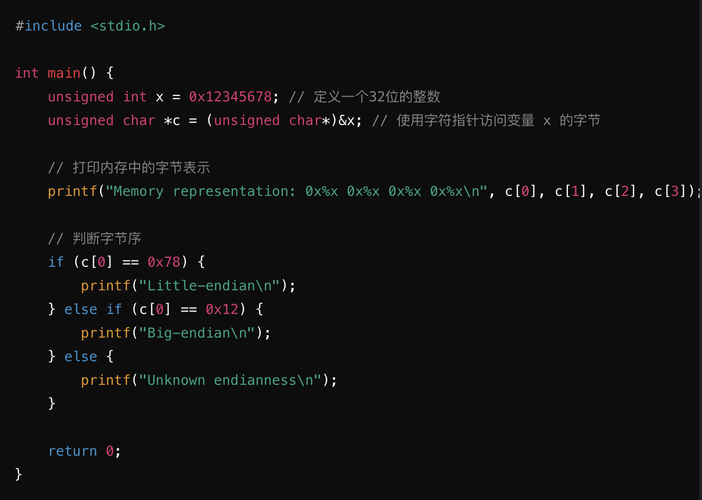
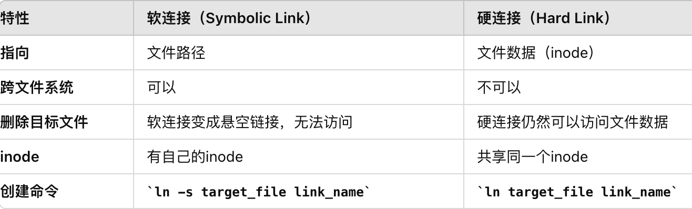
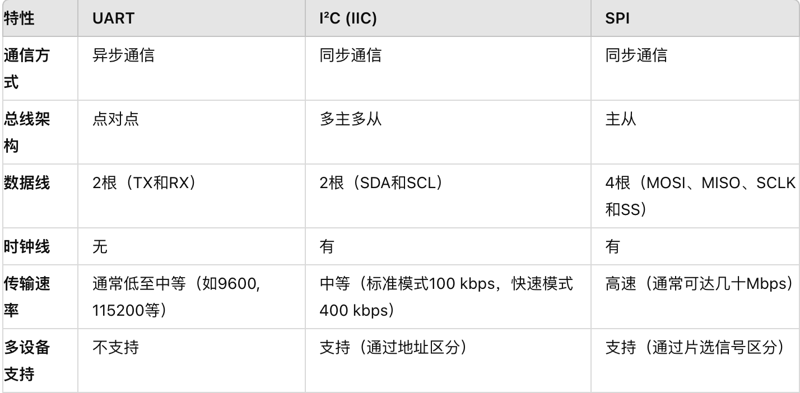

# 八股文高频问题
# 《C语言基础》
## 变量命名规则为
- 由字母、下划线、数字组成，且不能由数字开头
## GCC编译步骤
1. 预处理 -E 展开宏、包头文件、替换条件编译、删除注释等， 产生.i文件
2. 编译   -S 检查语法错误， 产生.s文件
3. 汇编   -c 将汇编指令翻译成机器源码， 产生二进制机器码文件.o文件
4. 链接   该阶段最重要的是库函数（静态库和动态库），将二进制机器码文件.o文件与静态库或者动态库文件，进行拼接，产生可执行文件.out文件
## strlen & sizeof
- strlen 是一个函数，用于计算字符串中字符的个数，不包括字符串结束符 '\0'，运行时计算。
- sizeof 是一个运算符，用于计算数据类型或变量的大小（占用的字节数），编译时计算。
## const关键字
- const & define
  - const可以用来声明一个变量或者函数参数为常量,提供类型安全，因为它具有数据类型，编译器会进行类型检查.
  - define在预处理阶段进行字符串替换，没有类型检查.
- 指针常量 & 常量指针(识别技巧： 先看到谁就读谁)
    - 指针常量：int *const p ---> *在const前出现，const修饰变量p,p的值不可变即它所指的方向不可变（address），但它所指向的里值可变（*p,value）
    - 常量指针：int const * p ---> const出现在*前，const修饰值*p,那么p所指向的内容不可变（*p），但指向的方向可以变化（address）
## static关键字
- 静态全局变量仅对当前文件可见，其他文件不可访问,如果没有赋值，编译器自动为其初始化，存储在数据段（静态存储区）
- 静态函数只能在声明它的文件中可见，其他文件不能引用该函数
## volatile关键字
用于声明一个变量，当该变量的值可能在程序的正常控制流之外发生变化时，例如由硬件设备、中断服务程序或者其他并发线程修改。
使用 volatile 告诉编译器不要对该变量进行优化，以确保每次访问该变量时都从内存中读取最新的值。
## extern关键字
- 用于声明外部变量或函数，表示此变量或函数是在其他文件中定会一的，需要在当前文件中引用
## strcpy & strncpy
- strcpy:
    - 不安全：它不检查 strDestination 中是否有足够的空间，可能导致缓冲区溢出。
## 指针 & 数组
- 指针与一维数组的操作一致，区别：指针是变量，数组名是常量数组名不能出现在等号左边。
- 数组指针：指向整个数组空间（例如：int arr[2];int *p=arr,p是数组指针）
  - 当为一维数组时，数组名=指针指向的数组的第一个元素；在二维数组中，数组名=指针，但是不再是指向数组的第一个元素，而是指向的是第一个子数组（第一排数组）。
- 指针数组：数组的每一个元素都是指针（如： int *ptrArr[5]）
## 值传递 & 地址传递
- 值传递：指在函数调用时，将实际参数的值复制一份传递给函数的形式参数，在函数内部对参数的操作不会影响到实际参数的值，形式参数和实际参数指向不同的内存位置。
- 地址传递： 在地址传递中，函数调用时，实际参数的地址（或引用）被传递给形式参数，形式参数和实际参数指向相同的内存位置，在函数内部对参数的操作会影响到实际参数的值。
## 函数指针 & 指针函数
- 函数指针：函数指针是指指向函数的指针变量，通过该指针调用相应的函数。
    - typedef int (*Operation)(int, int);int add(int a, int b) { return a + b;} ---> op = add;  // 将 add 函数的地址赋给op result = op(5, 3); // 通过 op 调用 add 函数
- 指针函数：指针函数是一个返回指针的函数。它实际上是一个函数，返回值类型是一个指针。
    - int* create_array(int size){...}
## 静态链接 & 动态链接
1. 静态链接在编译阶段完成，动态链接在程序运行时完成
2. 静态链接可执行文件包含了所有的目标代码和库函数代码，占用内存大，加载速度快
3. 动态链接生成的可执行文件更小，但更依赖于系统中已安装的共享库，加载速度慢
## C语言的内存对齐
- 为什么要对齐？各个硬件平台对存储空间的处理上有很大的不同，如果不按照适合其平台的要求对数据存放进行对齐，会在存取效率上带来损失
- 预编译指令#pragmapack (value)来告诉编译器，使用我们指定的对齐值来取代缺省的
- #pragma pack () /*取消指定对齐，恢复缺省*/

## C语言中，内存泄露的原因
1. 动态分配的内存没有被释放：当你使用malloc，calloc或realloc函数动态分配内存后，如果你没有使用free函数来释放这些内存，那么这些内存就会一直存在，直到程序结束。这就是内存泄露。 
2. 指针赋值问题：如果指针指向动态分配的内存块，然后该指针被重新赋值而没有释放原来的内存，就会导致内存泄露。 
3. 重复释放内存：如果你试图释放已经被释放的内存，可能会导致程序崩溃。
4. 循环引用：如果存在循环引用的数据结构，例如双向链表，可能会导致内存泄露，因为即使没有指向数据结构的指针，它们仍然相互引用，导致内存无法释放。
## 如何检查内存泄漏
- 使用valgrind工具，valgrind --leak-full=yes ./xxx（可执行程序）
- gdb
## 大小端存储方式
- 大端：大端序是一种将数据的高位字节存储在内存低地址处，而低位字节存储在内存高地址处的字节存储顺序。
    - 内存地址: 0x1000 0x1001 0x1002 0x1003
    - 数据内容: 12 34 56 78
- 小端：与大端相反
    - 内存地址: 0x1000 0x1001 0x1002 0x1003
    - 数据内容: 78 56 34 12
- 如何区分：
    - 通过检查变量的内存表示来判断CPU的字节序
    - 定义一个多字节整数，转换类型访问该变量的各个字节
    - 检查各个字节的值以确定字节序。

# 《OS》
# 网络管理
## 零拷贝
- 旨在解决数据传输过程的系统性能和资源利用效率差的问题，减少CPU的负载和内存的消耗
- 网络数据传输中，
  
## DMA技术
- I/O设备和内存进行数据传输的时候，数据搬运的工作交给DMA控制器，而CPU不再参与数据搬运相关的事物，CPU去处理别的事物。

## i/o多路复用（select、poll、epoll）
- 单线程或单进程中监听多个I/O事件的机制
- 使用系统调用函数（select、poll、epoll）同时监听多个I/O事件，一旦其中任何一个I/O操作就绪，立刻通知进程做相应处理
- select
- poll
- epoll

# 内存管理
## 用户态和内核态的区别
- 内核态下，CPU可以执行所有的指令和访问所有的硬件资源。此模式下的操作具有更高的权限，主要用于操作系统内核的运行。内核态的底层操作主要包括：内存管理、进程管理、设备驱动程序控制、系统调用等。
- 用户态下，CPU只能执行部分指令集，无法直接访问硬件资源。这种模式下的操作权限较低，主要用于运行用户程序。
  
## 什么是虚拟内存？
- 是操作系统提供给每个运行中程序的一种地址空间，每个程序在运行时认为自己拥有的内存空间就是虚拟内存，其大小远大于实际的物理内存大小。
- 虚拟内存划分为固定大小的段或者页，并将这些段或者页映射到物理内存的不同位置，如果物理内存中找不到相应的页，则发生缺页异常，陷入至内核空间，分配物理内存。使得程序在运行时可以更高效地利用物理内存。
  
## 虚拟地址是怎么转化到物理地址的？
- 虚拟地址转化到物理地址是由MMU管理完成的。
- 在虚拟地址转换过程中，通常使用页表来进行映射。页表是一种数据结构，存储在内存中。它将虚拟地址划分为固定大小的页（linux下为4KB），对应物理地址的页框。每个页表项纪录虚拟页和物理页的映射关系。
- 当程序访问一个虚拟地址时，MMU将虚拟地址分解为页号和页内偏移量。然后，MMU查找页号表，根据页号找到对应的页表项。页表项中包含物理页的基地，MMU将物理页的基地址与页内偏移量组合，得到对应的物理地址。
- 虚拟地址转化为物理地址的过程中，可能还涉及多级页表、快表等机制，以提高地址转换的效率。
  
## Linux用户空间的分布
- 代码段： 存放二进制可执行文件
- 数据段(.data)： 包含了程序中已经初始化的全局变量和静态变量等
- .bss段： 程序未初始化数据段包含了程序中未初始化的全局变量和静态变量等
- 堆段： 用于动态分配内存的区域
- 文件映射和匿名映射段： 包括动态库和共享内存等
- 栈段： 存储函数调用信息和局部变量的区域，存储函数的参数、返回地址和局部变量等信息。

## Linux内核空间和用户空间通信方式
-  系统调用: 系统调用是用户空间进程与内核交互的主要机制。用户空间进程可以通过系统调用请求内核提供的服务，例如文件操作、进程控制和内存管理。
-  设备文件： 通过设备文件，用户空间进程可以与内核中的设备驱动程序通信。设备文件通常位于 /dev 目录下，用户进程可以使用常规的文件操作（如 open、read、write 和 ioctl）与设备文件进行交互。
-  共享内存
-  消息队列
-  信号
-  管道
  
## 介绍MMU
- MMU（内存管理单元）是计算机系统中的一种硬件组件，负责管理虚拟内存和物理内存之间的映射。
- 它通过页表（Page Table）将虚拟地址转换为物理地址，实现虚拟内存的功能，从而允许每个进程拥有独立的地址空间。
- MMU在内存访问时检查相应的页表项，以确定虚拟地址是否有效并找到对应的物理地址，如果页表中没有找到对应的物理地址，则触发缺页异常，进入系统内核空间分配物理内存、更新进程页表，最后再返回用户空间，恢复进程的运行。
- MMU还支持内存保护、缓存控制和地址转换缓冲（TLB）等功能，进一步优化了内存管理性能。
  
## 堆和栈的区别
- 内存分配方式
  - 栈： 栈内存通常在程序编译时确定，大小固定。栈内存由编译器自动管理，函数调用时分配，函数返回时释放。
  - 堆： 堆内存在运行时分配，大小可以动态改变。堆内存需要手动分配和释放。
- 生命周期
  - 栈： 栈上的变量在其作用域结束时自动销毁。当函数返回时，所有在函数内分配的栈内存都会被释放。
  - 堆： 堆上的变量在手动释放之前会一直存在，生命周期由程序员控制。如果没有正确释放堆内存，会导致内存泄漏。
- 访问方式
  - 栈： 栈内存的访问速度很快，因为它们是按顺序存储的，CPU可以通过栈指针快速访问。栈空间较小，通常由操作系统设定一个固定的大小限制。
  - 堆： 堆内存的访问速度相对栈内存较慢，因为它们在内存中是随机存储的，CPU需要通过指针访问。堆空间较大，主要受限于系统的可用内存。
    
## 如果内存不足了该怎么办
- 直接释放：操作系统会尝试直接释放一些不再需要的内存资源，例如通过垃圾回收机制清理无用的缓存或临时数据。
- 后台进程：操作系统可能会将一些不活跃的后台进程置于休眠状态或直接终止，以腾出更多的内存供当前活动的进程使用。
- 触发OOM（Out Of Memory）杀手：当内存严重不足且无法通过前两种方式解决时，操作系统会触发OOM杀手机制，强制终止一些内存消耗较大的进程，以确保系统的稳定运行。这种机制通常会选择那些优先级较低、占用内存较多的进程进行终止，以最小化对用户体验的影响。
  
# 进程管理
## 进程和线程的区别
- 本质：进程是资源分配的基本单位；线程是任务调度的基本单位
- 开销：进程都有独立的代码和数据空间，程序间切换开销大；同类线程共享代码和数据空间，仅有独立的运行栈和程序计数器，线程之间切换开销小。
- 稳定性：进程中子进程的崩溃不影响其他进程；同一进程中的某一线程崩溃，可能会导致整个进程崩溃。

## 进程切换和线程切换的区别？
- 进程切换涉及内容较多，包括进程的地址空间、全局变量、文件描述符等，还包括了内核堆栈、寄存器等内核空间的资源。
- 线程切换只切换它的栈、寄存器、计数器等，不需要切换地址空间。

## 进程上下文有哪些？
- CPU上下文包括CPU寄存器和程序计数器。CPU寄存器：CPU 内部一个容量小，但是速度极快的缓存。程序计数器：存储 CPU 正在执行的指令位置、或者即将执行的下一条指令位置。
- CPU执行的任务有：线程、进程、中断。顾根据任务不同，将CPU上下文切换划分为：进程上下文切换、线程上下文切换、中断上下文切换。
- CPU上下文切换就是将前一个任务的CPU上文保存起来，然后加载新任务的上下文，然后跳转到程序计数器所指的新位置，运行新任务。当旧任务再此被调度器分配给CPU运行时，CPU重新加载此上下文，按照原来保存时的状态继续运行，状态不受影响。

## 进程间通信方式
- 管道、消息队列、共享内存、信号、信号量、socket
## 并发控制机制（线程间通信方式）（linux中的同步机制？）
原子操作、锁（自旋锁、读写锁）、信号量、互斥量（条件变量）
## 原子操作
原子操作是指在计算机系统中不可被中断的操作，即操作要么全部执行完毕，要么完全不执行。原子操作的关键特性是它们在执行期间不会被其他线程或进程干扰，从而保证了操作的完整性和一致性。
## 除了互斥锁你还知道什么锁？分别应用于什么场景？
- 读写锁：读写锁允许多个线程同时读取共享资源，但只允许一个线程对线程进行写操作。
- 自旋锁：忙等锁，加锁失败后，线程会忙等待，直到拿到锁。在用户态完成加锁和加锁，不产生线程切换，但如果被锁住的代码执行时间过长，自旋的线程会长时间占用 CPU 资源。故适用于临界区很小且锁的持有时间很短的场景，避免线程频繁切换带来的开销。
- 互斥锁：当一个线程尝试获取互斥锁但锁已经被其他线程持有时，该线程会被阻塞并进入睡眠状态，等待锁被释放。避免了CPU资源的浪费，但会引入上下文切换的开销。适用于锁持有时间较长的场景，因为线程在等待锁的过程中会被阻塞，不会消耗CPU资源。

## 自旋锁与互斥锁的区别

## 在中断服务程序里面的互斥是使用自旋锁还是信号量？为什么？
- 在中断服务程序中，需要保证对共享资源的访问是互斥的，但由于中断处理需要迅速完成，不能使用会导致阻塞的机制。
- 自旋锁可以在中断上下文中使用，但要确保在中断处理程序中使用自旋锁时禁用中断，避免自旋锁在中断处理中被再次中断，从而导致死锁
- 信号量不适合在中断上下文中使用，因为在中断上下文中不能进行阻塞操作。中断服务程序需要迅速完成，阻塞操作会导致系统响应延迟。
## 死锁的4个条件
- 互斥：资源一次只能被一个线程占用。
- 持有并等待：线程已经持有至少一个资源，并且正在等待获取其他资源，而这些资源被其他线程持有
- 不可抢占：资源不能被强制抢占，只能由持有它的线程显式释放。
- 循环等待：存在一个线程循环等待链，其中每个线程等待下一个线程所持有的资源
  
## 如何避免死锁
- 避免死锁问题就只需要破环其中一个条件就可以，最常见的并且可行的就是使用资源有序分配法，来破环环路等待条件。
- 资源有序分配法：线程A和线程B获取资源的顺序要一样，当线程A是先尝试获取资源A，然后尝试获取资源B的时候，线程B同样也是先尝试获取资源A，然后尝试获取资源B。也就是说，所有线程按相同顺序请求资源，避免循环等待。
# 文件系统管理
## 软链接和硬链接
- 软链接：软连接是一个指向另一个文件或目录的特殊文件。它类似于一个快捷方式，包含目标文件的路径。
- 硬连接是文件系统中同一个文件的另一个目录条目。它们共享相同的 inode，因此它们实际上是同一个文件的不同名称。
- 区别：

# 《计算机网络》

# 《外设基础》
## 中断
- 中断的作用
    - 中断使得计算机系统具备应对对处理突发事件的能力，提高了CPU的工作效率，如果没有中断系统，CPU就只能按照原来的程序编写的先后顺序，对各个外设进行查询和处理，即轮询工作方式，轮询方法貌似公平，但实际工作效率却很低，却不能及时响应紧急事件。
- 中断的分类
    - 内部中断和外部中断。外部中断又分为可屏蔽中断和不可屏蔽中断。内部中断通常分为陷阱、异常、终止。
- 中断的整个过程进行描述，从引线触发中断到终端服务函数？
  - step1: 中断触发：中断信号由外部设备（如按键、传感器等）或内部事件（如定时器溢出）触发，通过中断线（INTR或NMI）发送到处理器的中断控制器（如NVIC或GIC）。
  - step2: 中断响应：处理器检测到中断信号后，完成当前正在执行的指令，并保存当前的程序计数器（PC）和状态寄存器，以便中断处理结束后能够恢复。
  - step3: 中断优先级判断：中断控制器判断中断的优先级。如果触发的中断优先级高于当前正在处理的任务，中断控制器会选择合适的中断向量.
  - step4: 中断向量表查找：根据中断类型，中断控制器从中断向量表中找到对应的中断服务程序的入口地址。
    - 中断向量表是一个包含所有中断服务程序入口地址的数组，中断向量表（Cortex-M和Cortex-A的是有区别的）
    - Cortex-M的中断向量表列举出所有的中断向量，包括芯片外设的所有中断。
    - Cortex-A总共有8个异常中断，其中一个未使用。Cortex-A内核CPU的所有的外部中断都属于IRQ中断，当任意一个外部中断发生时都会触发IRQ中断，IRQ中断服务函数里读取指定的寄存器来判断发生的中断。
  - step5: 中断服务程序执行：处理器跳转到中断服务程序的入口地址，开始执行中断服务程序。中断服务程序负责处理特定的中断事件，例如读取传感器数据、清除中断标志位等。
  - step6: 中断结束：中断服务程序执行完毕后，执行中断返回指令，处理器恢复之前保存的程序计数器和状态寄存器，返回到中断前被中断的指令继续执行。  
  
- 中断服务函数带不带参数？为什么？
  - 中断服务函数通常不带参数，以简化中断处理机制，减少延迟，提高响应速度，并简化硬件调用和状态管理。
  
- 不可屏蔽中断
  - 不可屏蔽中断（Non-Maskable Interrupt, NMI）是一种特殊的硬件中断，具有最高优先级，不能被系统中的其他中断或软件屏蔽。NMI通常用于处理需要立即响应的紧急事件或严重错误，如硬件故障、电源问题或看门狗定时器超时。当
  - NMI触发时，处理器会立即暂停当前任务，保存上下文，并跳转到NMI服务程序处理相关紧急任务。由于NMI无法被屏蔽，其服务程序必须设计得简洁高效，以便快速响应和处理紧急事件。NMI的典型应用场景包括检测和处理硬件故障、电源异常以及系统锁死等关键状态。
  
- Linux系统中，中断处理机制
  - 在Linux系统中，中断处理过程始于中断信号的触发，这可以是由外部硬件设备（如键盘、网卡、定时器等）或内部软件事件引发。
  - 当中断发生时，中断控制器（如APIC）将信号传递给处理器，处理器暂停当前执行的任务，保存上下文，然后跳转到相应的中断服务程序（ISR）。
  - 在ISR中，处理器执行最小量的必要工作，以确保快速响应中断信号，通常包括读取设备状态、清除中断标志等。
  - 由于ISR在中断上下文中运行，无法进行阻塞操作，因此复杂的处理被推迟到延迟处理机制，如软中断（SoftIRQ）、任务队列（Tasklets）或工作队列（Workqueues）中执行。
  - 软中断用于处理高优先级任务，任务队列用于较低优先级的任务，工作队列允许在进程上下文中执行阻塞操作。
  - 在多处理器系统中，Linux内核还支持中断负载平衡，将中断分配到不同的CPU，以均衡处理负载并提升系统性能。
  - 中断处理程序必须注册到内核中，通常通过 request_irq 函数实现，而在设备驱动程序卸载时，则使用 free_irq 函数释放中断，确保系统资源的正确管理和释放。
  - 通过这样的机制，Linux能够高效地处理中断，确保系统的实时性和稳定性。
    
- Linux中断与非Linux中断的区别
  - 在Linux系统中，中断处理机制具有高度的灵活性和复杂性，支持动态注册和注销中断处理程序，并提供了多种延迟处理机制，如软中断、任务队列和工作队列，这些机制允许在不同的上下文中执行中断后续处理，确保系统的实时性和响应速度。此外，Linux内核还支持中断负载平衡，在多处理器系统中将中断分配到不同的CPU，以均衡处理负载并提升性能。
  - 相比之下，非Linux系统中断机制通常更加静态和固定，例如在嵌入式系统或传统操作系统中，中断处理程序往往是编译时确定的，缺乏动态注册和复杂的延迟处理机制。非Linux系统中断处理程序通常在硬件中断上下文中完成所有工作，可能会导致较长的中断处理时间，影响系统的实时性和响应能力。
  - 总体而言，Linux中断机制更为灵活和高效，适用于复杂和多任务的操作环境，而非Linux系统中断机制则更为简单，适用于资源受限的嵌入式系统。
## GPIO
- 在输入模式下，GPIO引脚可以读取外部设备的状态。在输出模式下，GPIO引脚可以控制外部设备的状态。
- 八种工作模式
    - 浮空输入：GPIO引脚配置为输入且没有内部上拉或下拉电阻。施密特触发器打开。这种模式适合用于由外部电路提供信号的情况。
    - 上拉输入：GPIO引脚配置为输入并且内部上拉电阻启用。施密特触发器打开。引脚默认处于高电平状态，有助于防止浮空状态。
    - 下拉输入：GPIO引脚配置为输入并且内部下拉电阻启用。施密特触发器打开。引脚默认处于低电平状态，适合需要默认低电平的场景。
    - 模拟功能：GPIO引脚配置为模拟信号的输入或输出，例如用于ADC（模数转换器）或DAC（数模转换器）。
    - 推挽输出模式：GPIO引脚可以输出高电平或低电平。施密特触发器工作，便于读取IO口状态。这种模式适合驱动LED等需要明确电平的设备。
    - 开漏输出模式：GPIO引脚可以输出低电平或高阻抗状态。施密特触发器工作，便于读取IO口状态。通常需要外部上拉电阻，适用于I2C总线等需要线与操作的场合。
    - 推挽式复用
    - 开漏式复用  
## UART
- 介绍：异步的串行通信协议。工作原理是将数据一位一位的进行传输，发送和接收各用一条线。uart接口与外界相连至少需要三条线：TXD、RXD、GND。
- 通信格式：起始位、数据位（通常为8位）、奇偶校验位、停止位。通信双方必须以相同的波特率进行通信，常见的波特率有9600、19200、115200等。
## I2C
- 介绍：同步的串行通信协
  -  双线制通信：I²C使用两条线进行数据传输：数据线（SDA）和时钟线（SCL），这两条线都需要上拉电阻。
  -  主从架构： I²C协议采用主从架构，多主多从。
  -  速度模式： I²C支持多种速度模式：标准模式（最高100 kbps）、快速模式（最高400 kbps等。
- 为什么两条线都需要上拉电阻？
    - 开漏驱动：²C设备通常使用开漏输出，它们只能将线拉低到低电平（逻辑0），但不能主动拉高到高电平（逻辑1）。上拉电阻通过提供一个高电平电压源，确保线路在没有设备拉低时处于高电平状态。
    - 多设备通信：I²C总线是一个多主多从的系统，多个设备可以连接在同一对总线上。上拉电阻使得任何设备在释放总线时，总线能恢复到高电平，从而确保其他设备能够正常通信。ß 
- I²C写数据过程
  - 启动信号：主设备发送一个起始信号，通知所有从设备开始通信。！！！起始信号：是当SDA（数据线）在SCL（时钟线）高电平时从高变低。
  - 发送从设备地址和写操作位：主设备发送从设备的地址，紧接着发送一个表示写操作的位（通常是0）。从设备接收地址，并在地址匹配时应答（ACK）。
  - 发送数据：主设备发送要写入的数据，每发送一个字节数据，从设备都会进行应答（ACK）。这个过程可以重复，直到所有数据字节发送完毕。
  - 停止信号：主设备发送停止信号，通知从设备通信结束。停止信号是当SDA在SCL高电平时从低变高。
- I²C读数据过程
  - 启动信号：主设备发送一个起始信号，通知所有从设备开始通信。！！！起始信号：是当SDA（数据线）在SCL（时钟线）高电平时从高变低。
  - 发送从设备地址和读操作位：主设备发送从设备的地址，紧接着发送一个表示读操作的位（通常是1）。从设备接收地址，并在地址匹配时应答（ACK）。
  - 读取数据：从设备将数据发送给主设备，每发送一个字节数据，主设备都会进行应答（ACK），表示数据接收成功。当所有需要的数据字节读取完毕后，主设备发送非应答（NACK）信号，表示不再需要更多数据。
  - 停止信号：主设备发送停止信号，通知从设备通信结束。停止信号是当SDA在SCL高电平时从低变高。
## SPI
- 介绍：同步的串行通信协。
    -  四线制通信：CS片选线（用于选择需要通信的设备）、SCK时钟线、MOSI主出从入线（主机发送数据到从机）、MISO主入从出线（从机发送数据到主机）。
    -  主从架构： SPI协议采用主从架构。单主多从。
    -  4种工作模式：由时钟极性和相位两两排列组合为4种。
    -  通信过程：SPI是全双工通信，读写时序一起完成。首先CS片选信号先拉低，选择通信从设备，然后MOSI数据线发送数据给从设备，同时从设备通过MISO数据线给主机返回数据。

## UART、IIC、SPI的区别

# 《驱动》
## 讲讲字符设备驱动
### 定义：字符设备驱动是操作系统内核中的一个模块，用于管理和控制字符设备（如：按键、串口等）。字符设备通过字符流方式与用户空间进行交互，设备驱动程序负责处理从用户空间到设备的字符输入和从设备到用户空间的字符输出。
### 实现字符设备驱动的基本步骤：
    - 定义文件操作结构：过定义 file_operations 结构体，指定设备的操作方法，如 open、read、write、release 等。
    - 实现文件操作方法：编写具体的 open、read、write、release 等操作方法。
    - 注册字符设备：使用 register_chrdev 函数注册字符设备。
    - 模块初始化和退出函数：在模块加载和卸载时进行相应的初始化和清理操作。
### 字符设备驱动对应用层的借口API的形式：
    - 字符设备驱动程序通过文件操作接口与应用层交互，应用层程序通过标准的文件操作API访问字符设备。如：open、read、write、iotcl、close。
### file_operation结构体（内核驱动操作函数的集合）
- file_operations 结构体定义了字符设备驱动程序中一组与文件操作相关的函数指针。每个函数指针指向驱动程序实现的相应操作函数。这些操作函数允许内核通过标准文件操作接口与字符设备进行交互。通过实现和注册这些操作函数，驱动程序可以控制设备的打开、关闭、读写等操作。

## 平台（Platform）设备驱动
### 定义：平台设备驱动框架用于处理那些不通过总线，进行枚举和管理的设备。这些设备通常是SOC上的片上设备（如定时器、GPIO 控制器等）。
### 有无设备树的区别
- 在没有设备树的Linux内核下，我们需要分别注册platform_device和platform_driver，分别代表设备和驱动。
- 在有设备树的Linux内核下，设备描述被放到设备树中，不需要编写platform_device，只需编写platform_driver。
### 设备与驱动匹配方式
- OF类型的匹配（即设备树），使用 compatible 属性进行匹配，驱动程序通过定义 of_device_id 结构体数组并将其指向 of_match_table 来实现。
- ACPI 匹配 使用 ACPI 表中的 _HID 或 _CID 属性进行匹配，驱动程序通过定义 acpi_device_id 结构体数组并将其指向 acpi_match_table 来实现。
- id_table 匹配 使用设备标识信息进行匹配，驱动程序通过定义 platform_device_id 结构体数组并将其指向 id_table 来实现。
- name 字段匹配 通过比较驱动和设备的 name 字段进行匹配，不依赖于 compatible 属性。

## linux设备和驱动如何匹配？
- 一般如果系统用了设备树，那就是比较compatible属性，设备节点和驱动匹配成功后自动执行prob函数。
- 如果没用设备树，那就是比较name字段，实际两者比较的都是字符串，相当于名字一样算匹配成功.
  
## compatible属性的作用
- 它的值得是字符串列表，他的作用是将设备和驱动绑定起来

## I2C子系统驱动框架
### 定义
I2C 设备通常使用 I2C 子系统驱动框架来编写驱动程序。I2C 子系统驱动框架在 Linux 内核中提供了对 I2C 总线及其连接设备的支持。具体而言，I2C 子系统框架可以看作是总线驱动框架的一部分，它专门用于处理 I2C 总线上的设备。
### I2C 子系统驱动框架包括两部分
- I2C 总线驱动（I2C bus driver）： 负责管理 I2C 总线本身，通常由 I2C 控制器驱动程序实现。它处理 I2C 总线的初始化、时钟配置、数据传输等。
- I2C 设备驱动（I2C device driver）： 负责管理连接到 I2C 总线的具体设备，如传感器、EEPROM 等。

# 《系统和根文件系统移植》
## 什么是ubootloader?
- 引导加载程序。它能够识别和加载操作系统内核、初始化硬件设备并设置一些基本参数等
- 此过程有两个阶段
  - 阶段1: 汇编，初始化C怨言环境，初始化DDR，设置栈指针sp等
  - 阶段2: 完成硬件初始化，建立内存映射，将内核Image和设备数文件读取到内存DDR，然后启动内核
## uboot的启动过程？
- 加载kernel的Image。从外部flash中的内核镜像和设备树文件加载至DDR
- 设置启动参数bootargs和biootcmd。
- 启动内核。uboot将启动参数传入内核，并将执行权限交给内核。
## bootargs和bootcmd
- bootargs：它保存着uboot传递给linux内核的参数。
- bootcmd:  它保存着uboot的默认命令，这写命令用于linux内核的启动，可以在uboot启动后进入命令设置。

# 《ARM》

# 《Linux内核基础》
## 什么是交叉编译工具链？
- 在一种架构上编译另外一种架构的代码，使得运行架构下生成的执行文件，能够在目标架构下运行该执行文件。

# 《Linux常用命令》
- dmesg
- ps aux |
- grep
- du
- fdisk
- top

